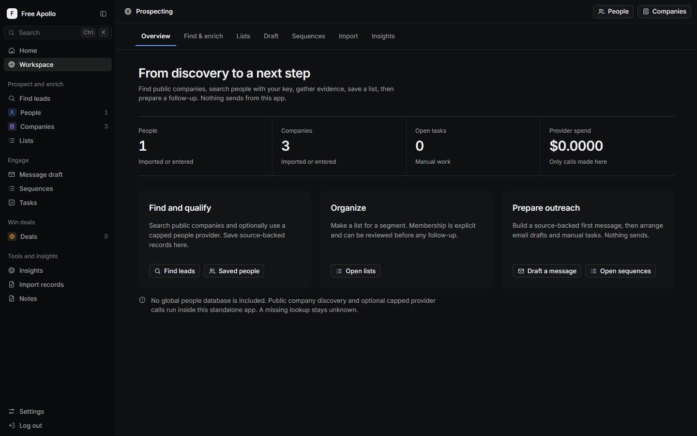
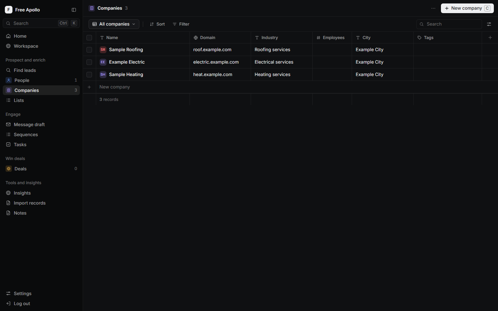
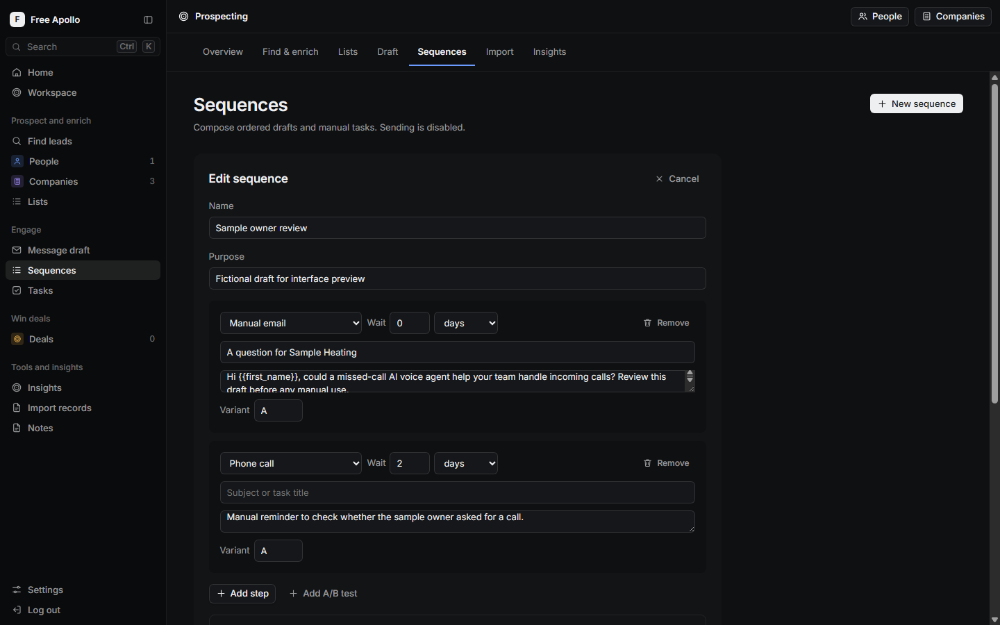
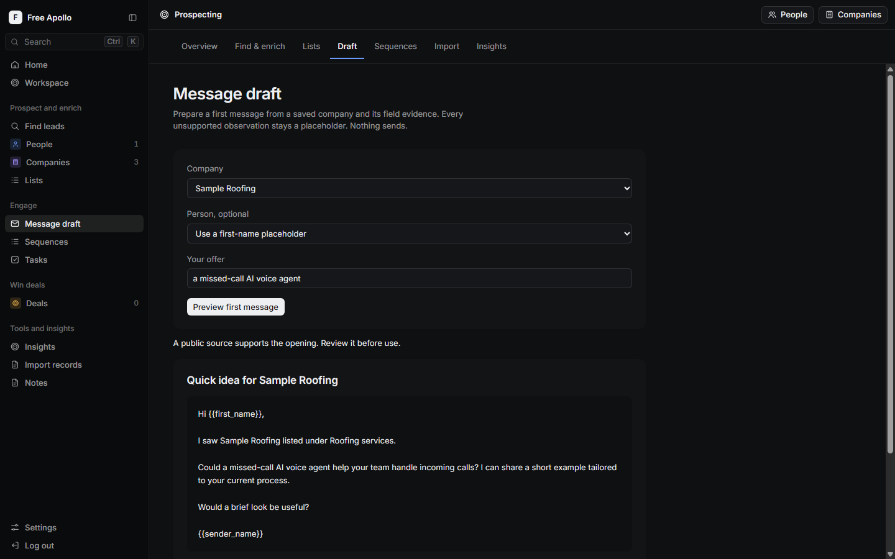

# Free Apollo

A standalone prospecting, engagement planning and CRM workspace. It uses proven patterns from earlier builds but runs with its own Worker, database and assets. No Free Clay or Free CRM install is needed. It copies Apollo-style workflows without claiming access to Apollo's licensed people database. This project is independent and is not affiliated with Apollo.io.

## What works

- Search public companies by industry through Wikidata and local businesses through OpenStreetMap. City lookup needs an application contact address. Optionally search people by title and company through a capped provider using your own key.
- Find or verify a saved person's work email with a separate cap and visible result state. A found email is not marked verified.
- Search, filter, sort and save views for people, companies and deals already in your database.
- Import or export CSV from the People and Companies pages. CSV export protects spreadsheet cells that could run formulas.
- Make explicit people or company lists, then add saved records.
- Write ordered email, call, action and manual LinkedIn drafts with minute, hour or day delays, variants, schedule and safety rules. Plan people for a sequence. There is no send path.
- Preview a first message using a cited company field. Unsupported observations remain visible placeholders. Save the result as a draft sequence.
- Track tasks, notes, deal stages, pipeline and activity in this app's own database.
- Import a generic sourced records file in batches of five. Older transfer files also work. Duplicate email or domain matches reuse the existing record. Field sources, links and dates are kept when available; missing dates stay unknown. Import does not mark an email verified.
- See coverage and actual provider spend in this app's own ledger. The free public path makes no paid calls.

The source code, tests and Worker run locally. The app has one Cloudflare Worker, one D1 database and static assets. Cloudflare [Workers](https://developers.cloudflare.com/workers/platform/limits/) and [D1](https://developers.cloudflare.com/d1/platform/limits/) limits apply to a deployed free account. The current build has been tested locally; it has not been deployed.

## Preview

These screenshots use fictional `example.com` records in an isolated local database.









## Current limits

This is a working standalone alternative, but it is not a one-to-one replacement for paid Apollo. It does not include Apollo's licensed dataset, broad filter catalogue, mailbox sync, live sending, tracking, dialer, website visitor identity, automatic CRM sync or most integrations. Public discovery and optional capped person and email calls run inside this app. A failed lookup remains unknown or retryable. The current AI OS plan pauses cold email and SMS, so drafts remain drafts.

For the local run and sourced import, see [SETUP.md](SETUP.md) and [TRANSFER.md](TRANSFER.md). The logged-in UI observations and measured comparison are in [Apollo reanalysis](docs/APOLLO-REANALYSIS.md) and [Apollo comparison](docs/APOLLO-COMPARISON.md).

## Check it

```text
npm install
npm test
```

The tests cover records, source evidence, capped provider calls, drafts, sequence planning and migration from earlier local installs.
